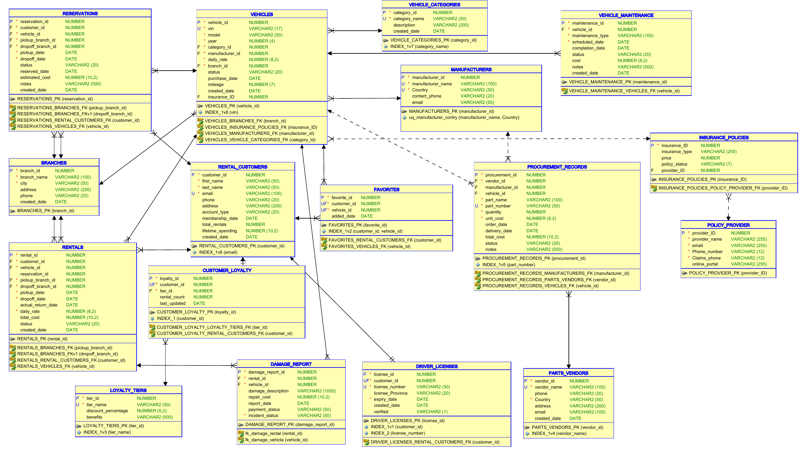

# Car Rental Company – Relational Database

A relational database designed and implemented in **Oracle SQL** for a modern car rental company. It manages customers, vehicles, reservations, rentals, maintenance, damage reports, insurance, loyalty programs, and supplier/procurement data, and supports 10 business queries for operations and executive reporting.

> Course project for **COMP 122 – Introduction to Databases** (Group 3)

---

##  Table of Contents

- [Project Overview](#-project-overview)
- [Tech Stack](#-tech-stack)
- [Entity Relationship Diagram](#-entity-relationship-diagram)
- [Database Design](#-database-design)
- [Getting Started](#-getting-started)
- [Business Queries](#-business-queries)
- [Screenshots](#-screenshots)
- [Repository Structure](#-repository-structure)
- [Team](#-team)

---

##  Project Overview

The goal of this project is to design and implement a relational database for a car rental business. The system supports the needs of four stakeholder groups:

| Stakeholder | What they do |
|---|---|
| **Customers** | Create accounts, search and reserve vehicles, make payments |
| **Rental Agents** | Process check-ins/check-outs, record vehicle condition |
| **Managers** | View reports, monitor fleet usage and revenue |
| **Mechanics / Suppliers** | Support vehicle maintenance and parts supply |

**Functional requirements:** register customers · search available vehicles · manage reservations · track rentals · track vehicle maintenance · handle damage reports.

**Non-functional requirements:** data integrity and security · support for many concurrent users · fast query performance (indexes on key columns).

---

##  Tech Stack

- **Database:** Oracle Database (uses `GENERATED BY DEFAULT AS IDENTITY`, so Oracle 12c or newer)
- **Language:** SQL / Oracle SQL (DDL + DML + queries)
- **Tools:** Oracle SQL Developer, Oracle Data Modeler (ERD)

---

##  Entity Relationship Diagram



*Full-resolution PDF: [docs/Car_RentalERD.pdf](docs/Car_RentalERD.pdf)*

---

##  Database Design

The database has **17 tables** grouped by function:

| Area | Tables |
|---|---|
| **Customers** | `RENTAL_CUSTOMERS`, `DRIVER_LICENSES`, `CUSTOMER_LOYALTY`, `LOYALTY_TIERS`, `FAVORITES` |
| **Fleet** | `VEHICLES`, `VEHICLE_CATEGORIES`, `MANUFACTURERS`, `BRANCHES` |
| **Bookings & rentals** | `RESERVATIONS`, `RENTALS`, `DAMAGE_REPORT` |
| **Maintenance & supply chain** | `VEHICLE_MAINTENANCE`, `PROCUREMENT_RECORDS`, `PARTS_VENDORS` |
| **Insurance** | `INSURANCE_POLICIES`, `POLICY_PROVIDER` |

**Design highlights**

- Primary keys on every table, auto-generated with Oracle identity columns
- Foreign keys enforce referential integrity (e.g., a rental must reference a real customer, vehicle and branch)
- `UNIQUE` constraints on natural identifiers such as `email`, `vin`, `license_number`, `part_number`
- Separate pickup and drop-off branches on both `RESERVATIONS` and `RENTALS` (supports one-way rentals)
- Composite unique constraint on `MANUFACTURERS (manufacturer_name, Country)`
- Indexes on frequently searched columns (`email`, `vin`, `license_number`, etc.)
- Designed to be normalized (up to 3NF)

---

## Getting Started

###  Prerequisites

- Oracle Database 12c+ (or Oracle Database XE / Oracle Live SQL)
- Oracle SQL Developer (or SQL*Plus)

###  Setup

1. **Clone the repository**
   ```bash
   git clone https://github.com/sunesh-shrestha/Car-Rental.git
   cd Car-Rental
   ```

2. **Open Oracle SQL Developer** and connect to your database.

3. **Run the schema and sample data script**
   ```sql
   @sql/CarRental_ddl.sql
   ```
   This script:
   - drops any existing project tables (so it is safe to re-run; the first run may show harmless "table does not exist" errors),
   - creates all 17 tables with constraints and indexes,
   - inserts sample data (customers, vehicles, rentals, damage reports, procurement records, etc.).

4. **Run the business queries** from `sql/` (or copy them from `docs/Car_rental_business_requirements.docx`) and inspect the results.

---

##  Business Queries

Ten queries answer real business questions:

| # | Business need | What it does |
|---|---|---|
| 1 | **Vehicle Discovery** | Filter available vehicles by category, branch city and daily rate |
| 2 | **Reservation Management** | Track pending/confirmed reservations with estimated cost and branches |
| 3 | **User Account Management** | Customer profiles with driver's-license verification status |
| 4 | **Logistics Tracking** | Rental fulfillment status between pickup and drop-off branches |
| 5 | **Supply Chain Management** | Open procurement orders with vendor, manufacturer and days in transit |
| 6 | **Executive Reporting** | Monthly rental revenue, average rental cost, fleet utilization |
| 7 | **Inventory Analytics** | Most popular vehicle models, ranked by rental volume |
| 8 | **Customer Segmentation** | Loyalty tiers by rental history and lifetime spending |
| 9 | **Wish List Engagement** | Vehicles and classes customers saved as favorites |
| 10 | **Customer Service Processing** | Return refunds net of damage/repair costs |

**Example – Vehicle Discovery**

```sql
SELECT v.vehicle_id,
       m.manufacturer_name || ' ' || v.model AS "VEHICLE",
       v.daily_rate AS "Daily Rate",
       v.mileage,
       vc.category_name AS "Vehicle Type",
       b.branch_name, b.city,
       v.status AS "Availability"
FROM VEHICLES v
JOIN MANUFACTURERS m      ON v.manufacturer_id = m.manufacturer_id
JOIN VEHICLE_CATEGORIES vc ON v.category_id    = vc.category_id
JOIN BRANCHES b           ON v.branch_id       = b.branch_id
WHERE vc.category_name IN ('SUV', 'Sedan')
  AND b.city = 'Toronto'
  AND v.daily_rate BETWEEN 50 AND 100
  AND v.status = 'Available'
ORDER BY v.daily_rate ASC;
```

---

##  Screenshots

<!-- TODO: add your SQL Developer screenshots to docs/images/ and update the file names below -->

| Creating tables | Sample data | Query result |
|---|---|---|
|  |  |  |

---

##  Repository Structure

```
Car-Rental/
├── README.md
├── sql/
│   └── CarRental_ddl.sql          # tables, constraints, indexes, sample data
├── docs/
│   ├── Car_RentalERD.pdf          # full ERD
│   ├── Car_rental_business_requirements.docx
│   ├── IntroDBProject_Car_Rental.pptx   # project presentation
│   └── images/
│       └── erd.png
```

---

##  Team

| Name | GitHub |
|---|---|
| Tristin | [@username](https://github.com/username) |
| Jeff | [@username](https://github.com/username) |
| Sunesh | [@sunesh-shrestha](https://github.com/sunesh-shrestha) |
| Becca | [@username](https://github.com/username) |

---

##  Future Improvements

- Add a `PAYMENTS` table to fully cover payment processing
- Add stored procedures / triggers (e.g., auto-update `total_rentals` and `lifetime_spending` after a completed rental)
- Add views for common reports
- Add role-based access (agent, manager, customer) for data security

---

##  License

This project was created for educational purposes.
